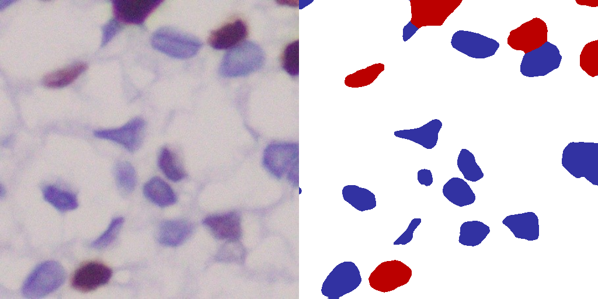

# Bladder-Cancer-Cell-Prediction
 ## **Abstract** ##
 Detection of Bladder Cancer is done by image analysis of KI-67 immuno-stained tissue sections. KI-67 helps in the easy differentiation of malignant (red) and benign cells (blue). The percentage of malignant cells allows doctors to measure the extent of bladder cancer and act accordingly. This report includes semantic segmentation algorithms using deep learning architectures on KI67 stained images. The classifier detects the positive tumour cells and calculates the KI Index. Manual annotation of images using Adobe Photoshop was done to provide the ground truth images. Literature survey was done to decide upon the best model. A 3-class classifier model was trained and tested. A GUI was created to display the original tissue image, predicted image and the corresponding KI Index.
## **Problem Statement** ##
KI 67 Cancer Detection Test is widely used to determine the proliferation index from the stained tissue images. However, it is a manual process, thereby reducing the efficiency and delaying the process. We aim to provide an automated solution to this problem.
We used the UNET model to segment benign, malgnant and background.
## **Architectural Details** ##

* The U-Net is convolutional neural network architecture for fast and precise segmentation of medical images.
* The network is a fully convolutional network and its architecture was modified to work with fewer training images and to yield more precise segmentations.
* The network consists of a contracting path and an expansive path, which gives it the u-shaped architecture.
* The contracting path is a typical convolutional network that consists of repeated application of convolutions, each followed by a rectified linear unit (ReLU) and a max pooling operation.
* During the contraction, the spatial information is reduced while feature information is increased.
* Contraction path consists of the repeated application of two 3x3 convolutions (unpadded convolutions), each followed by a rectified linear unit (ReLU) and a 2 x 2 max pooling operation with stride 2 for downsampling.
* The expansive pathway combines the feature and spatial information through a sequence of up-convolutions and concatenations with high-resolution features from the contracting path.
* Every step in the expansive path consists of an upsampling of the feature map followed by a 2x2 convolution (up-convolution) that halves the number of feature channels, a concatenation with the correspondingly cropped feature map from the contracting path, and two 3x3 convolutions, each followed by a ReLU.
* Cropping is necessary to compensate loss of border pixels in every convolution. At final layer a 1x1 convolution is used to map each 64 component feature vector to the desired number of classes.
* In total the network has 23 convolutional layers
## Implementation ##
80 images were obtained from the KMC Hospital. Data Augmentation was used generate a total of 2880 images for training and 1920 images for testing. These images were obtained from a total of 8 patients.  
Pre-processing: The images were one hot encoded.  
Training Model:  
*	2880 images were used for training and 1920 images for testing.
*	The full resolution 1920x1440 images were randomly cropped into images of size 512x512.
## Results ##

| Model      | Precision | Recall | F1 score | IOU Score |
| ---------  | --------  | ------ | -------- | --------- |
| UNET       | 0.9599    | 0.9599 | 0.9599   | 0.9230    |
 
 ## **Graphical User Interface** ##
 * We developed a custom graphical user interface to select a tissue image and segment the image accordingly. 
 * The GUI was made using tKinter, a python library.
 * The GUI has 2 Buttons, 2 Image display units and a text box.
 * Select Image button - Enables user to browse and select directory of choice which contains images for testing. Predict - Runs the trained UNET architecture in background to generate the segmented map of the tissue image.
* View Important Info tab - Enables user to view the Jaccard Score, F1 Score and the KI index.

.png "GUI")

## **Requirements** ##
* Python 3
* CUDA >= 8.0
* Tensorflow >= 2.0

 ## **Directions to use** ##
* Change the paths in the train.py and test.py file to the train and test directory.
* The train directory should have images in the format train/img/img/1,2,3... and train/mask/mask/1,2,3... Similarly for the test directory, test/img/img/1,2,3... and test/mask/mask/1,2,3..
* The generator class in keras requires the images to be in a subfolder inside the main folder (i.e img/img).
* You can try different segmentation models instead of UNET. Import the model code in the train.py and test.py

